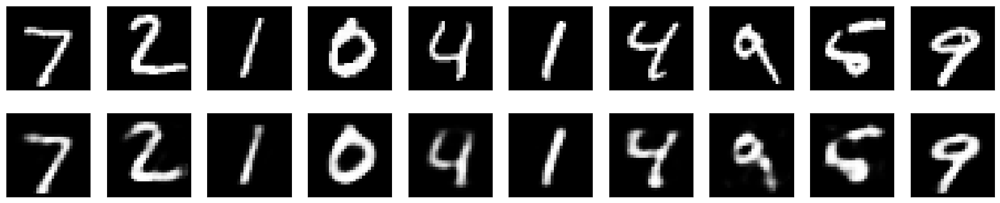
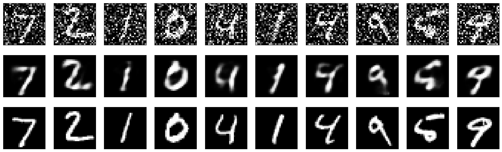

# Keras Autoencoder for MNIST Reconstruction and Denoising

This project builds an autoencoder with an encoder that compresses the input to 32 dimensions and a decoder that reconstructs the input from these 32 dimensions.

It uses the MNIST handwritten digit dataset, trains a fully connected autoencoder to reconstruct images, then extends the same model to denoise corrupted images. The notebook also includes a simple fine-tuning stage where layers are frozen and then unfrozen before additional training.

## Project Overview

The workflow in this project is:

1. Import TensorFlow and verify the environment.
2. Load the MNIST dataset.
3. Normalize pixel values to the range `[0, 1]`.
4. Flatten each `28 x 28` image into a `784`-dimensional vector.
5. Build an autoencoder model.
6. Train the model where the training data is both the input and the target, as the autoencoder learns to map the input to itself.
7. Reconstruct test images and compare the original images with their reconstructions.
8. Freeze layers, check trainable status, unfreeze selected layers, and train again for fine-tuning.
9. Add artificial noise to the images.
10. Train the autoencoder as a denoising model by feeding noisy images as input and clean images as target.
11. Compare noisy inputs, denoised outputs, and original clean images.

## Data Preprocessing

The notebook performs the following preprocessing steps:

- Load the MNIST dataset from `tensorflow.keras.datasets`.
- Convert the image arrays to `float32`.
- Normalize pixel values by dividing by `255`.
- Flatten the `28 x 28` images into vectors of length `784`.

This flattening step converts each image into a single 1D input vector so it can be used with fully connected `Dense` layers.

## Model Architecture

The autoencoder is built as a symmetric dense neural network.

### Architecture

- an input layer with 784 neurons.
- Dense layer with 64 neurons and ReLU activation.
- Dense layer with 32 neurons and ReLU activation.
- Dense layer with 64 neurons and ReLU activation.
- Add an output layer with 784 neurons and sigmoid activation.

### Interpretation

- The first `Dense(64, relu)` layer starts compressing the input representation.
- The `Dense(32, relu)` layer is the bottleneck, which acts as the compressed latent representation.
- The next `Dense(64, relu)` layer begins decoding from the compressed representation.
- The final `Dense(784, sigmoid)` layer reconstructs the full image.

So the network learns a lower-dimensional representation of the image and then tries to rebuild the original image from it.

## Step-by-Step What the Project Does

### 1. Environment Check

The notebook first imports TensorFlow and prints its version to confirm the framework is available.

### 2. Data Preprocessing

The notebook loads MNIST and prepares the data for a dense autoencoder:

- load training and test images
- normalize pixel values
- flatten each image into a `784`-dimensional vector

### 3. Building Autoencoder Model

The model is built with:

- an input layer with 784 neurons.
- Dense layer with 64 neurons and ReLU activation.
- Dense layer with 32 neurons and ReLU activation.
- Dense layer with 64 neurons and ReLU activation.
- Add an output layer with 784 neurons and sigmoid activation.

### 4. Training

Training data is both the input and the target, as the autoencoder learns to map the input to itself.

So during training, the model receives:

- input: original flattened image
- target: same original flattened image

This teaches the autoencoder to reconstruct the input.

### 5. Evaluating Reconstruction

After training, the model predicts reconstructed versions of the test images and plots them.

In above output:

- top row: original input images
- bottom row: reconstructed images produced by the autoencoder

So the model is not displaying two different evaluation outputs. It is showing a comparison:
original vs reconstruction.

The second row can look “better” because the autoencoder often learns to keep the main digit shape and drop small noise, blur, or stray pixels, so the reconstruction can look cleaner than the raw input.

### 6. Fine-Tuning Autoencoder

Fine-tuning the autoencoder by unfreezing some layers can help in improving its performance. Here I unfreeze the last four layers and train the model again for a few more epochs.

Basically almost everything trainable gets trained again for more epochs.

In the fine-tuning section, the notebook does:

1. Freeze all the Encoder Layers
2. Check the Status
3. Unfreeze the Encoder Layers
4. Compile and Train the Model

Recompile the model.

This stage is included to demonstrate layer freezing and retraining behavior.

### 7. Denoising Image

The final section turns the same autoencoder into a denoising autoencoder.

**1. Corrupt the input images with artificial noise:**
- Inject randomly generated noise into both the training set and the test set.
- Fit the autoencoder on these corrupted images as the inputs.
- Keep the clean, uncorrupted images as the desired outputs during training.

**2. Measure how well the model removes noise:**
- Run the noisy test images through the autoencoder to produce cleaned reconstructions.
- Visually compare three versions of each image: the noisy input, the reconstructed output, and the original clean image.

This shows that the model can learn not only to reconstruct inputs, but also to recover cleaner images from noisy ones.

## Why the Optimizer and Loss Function Were Chosen

The model is compiled with:

- optimizer: `adam`
- loss: `binary_crossentropy`

### Why `adam` was chosen

`Adam` is a standard choice because:

- it usually converges faster than plain stochastic gradient descent
- it adapts the learning rate automatically for each parameter
- it works well for dense neural networks without requiring much manual tuning
- it is a practical default for image reconstruction tasks in Keras examples and teaching notebooks

Since this project is a compact educational autoencoder, `Adam` is a reasonable optimizer because it is stable, simple, and effective.

### Why `binary_crossentropy` was chosen

`binary_crossentropy` makes sense here because:

- the pixel values are normalized to the range `[0, 1]`
- the output layer uses a `sigmoid` activation, which also produces values in `[0, 1]`
- each output pixel can be interpreted as a value to match a normalized pixel intensity

In other words, the model is reconstructing normalized pixel values, and the `sigmoid + binary_crossentropy` combination is a common choice for MNIST autoencoders.

A different project could also use mean squared error, but in this notebook `binary_crossentropy` is a natural fit because of the normalized inputs and sigmoid output.

## Technical Characteristics

This project includes several important technical ideas:

- fully connected autoencoder architecture
- latent bottleneck representation of dimension `32`
- reconstruction learning where input equals target
- image preprocessing through flattening
- fine-tuning by freezing and unfreezing layers
- denoising autoencoder training using noisy inputs and clean targets
- visualization of reconstruction quality with matplotlib

## Packages Used

The notebook directly uses these packages:

- `tensorflow`
- `numpy`
- `matplotlib`
- `importlib.util`
- `sys`

From TensorFlow / Keras, it specifically uses:

- `tensorflow.keras.datasets.mnist`
- `tensorflow.keras.models.Model`
- `tensorflow.keras.layers.Input`
- `tensorflow.keras.layers.Dense`

## Files in the Repository

- `Keras-autoencoder.ipynb` — main notebook containing preprocessing, model building, training, fine-tuning, and denoising
- `README.md` — project documentation
- `model-output.png` — figure showing original images and reconstructed outputs
- `fine-tune-output.png` — figure related to the later-stage results / fine-tuned or denoising output visualization

## Figures

To make the figures render correctly on GitHub, keep the image files in the repository root and reference them like this.

### Reconstruction Output



This figure shows the reconstruction results:
- top row: original input images
- bottom row: reconstructed images produced by the autoencoder

### Fine-Tuning / Denoising Output



This figure shows the later-stage output of the project, where the model is trained further and used in the denoising workflow.

## Summary

This project demonstrates how to build a Keras autoencoder for MNIST using dense layers. It starts with data preprocessing, builds a compact encoder-decoder architecture, trains the model to reconstruct handwritten digits, visualizes original versus reconstructed outputs, then extends the same model through fine-tuning and denoising. The project is a clear end-to-end example of representation learning, image reconstruction, and denoising with TensorFlow and Keras.
```
