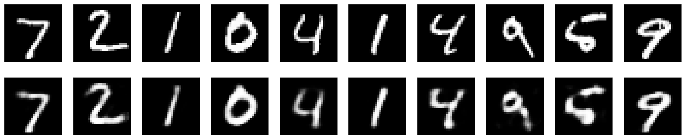
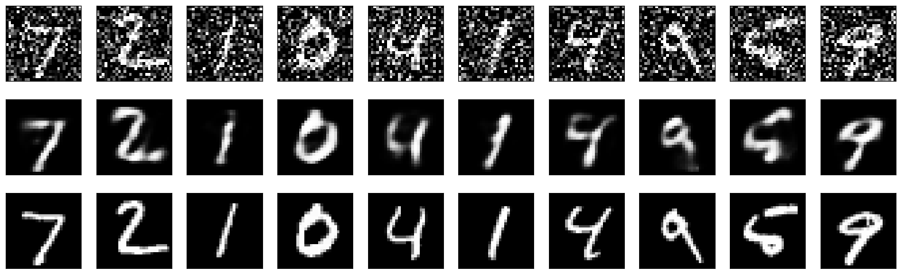

# Keras Autoencoder for MNIST Reconstruction and Denoising

This project builds an autoencoder with an encoder that compresses the input to 32 dimensions and a decoder that reconstructs the input from these 32 dimensions.

It uses the MNIST handwritten digit dataset, trains a fully connected autoencoder to reconstruct images, then extends the same model to denoise corrupted images. The notebook also includes a fine-tuning stage where layers are frozen and then unfrozen before additional training.

## Project Overview

1. Import TensorFlow and verify the environment.
2. Load the MNIST dataset.
3. Normalize pixel values to `[0, 1]`.
4. Flatten each `28 x 28` image into a `784`-dimensional vector.
5. Build the autoencoder.
6. Train it with the training data as both input and target.
7. Reconstruct test images and compare them with the originals.
8. Freeze layers, check trainable status, unfreeze layers, and train again.
9. Add artificial noise to the images.
10. Train a denoising version with noisy images as input and clean images as target.
11. Compare noisy inputs, denoised outputs, and original images.

## Data Preprocessing

- Load MNIST from `tensorflow.keras.datasets`.
- Convert the arrays to `float32`.
- Divide pixel values by `255`.
- Flatten the `28 x 28` images into vectors of length `784` so they can be used with `Dense` layers.

## Model Architecture

- Input layer with 784 neurons
- `Dense(64, relu)`: starts compressing the input
- `Dense(32, relu)`: the bottleneck (latent representation)
- `Dense(64, relu)`: starts decoding
- `Dense(784, sigmoid)`: reconstructs the full image

The network learns a lower-dimensional representation of the image and then rebuilds the image from it.

## Training and Reconstruction

The model receives the original flattened image as both input and target, so it learns to reconstruct its input.

Top row: original test images. Bottom row: reconstructions. The reconstructions often look cleaner than the inputs, because the autoencoder keeps the main digit shape and drops small noise and stray pixels.

## Fine-Tuning

1. Freeze the encoder layers
2. Check the trainable status
3. Unfreeze the encoder layers
4. Recompile and train for a few more epochs

This part shows how freezing and retraining layers behaves in Keras.

## Denoising

1. Add random noise to both the training and test images.
2. Train the autoencoder with noisy images as input and clean images as target.
3. Run the noisy test images through the model and compare the noisy input, the denoised output, and the original image.

## Optimizer and Loss

- Optimizer: `adam`. It adapts the learning rate per parameter and usually converges faster than plain SGD without much tuning.
- Loss: `binary_crossentropy`. Pixel values are in `[0, 1]` and the output layer is `sigmoid`, so each output pixel matches a normalized intensity. Mean squared error would also work.

## Packages Used

- `tensorflow` (`keras.datasets.mnist`, `Model`, `Input`, `Dense`)
- `numpy`
- `matplotlib`

## Files

- `Keras-autoencoder.ipynb`: main notebook
- `model-output.png`: original vs. reconstructed images
- `fine-tune-output.png`: output after fine-tuning and denoising
